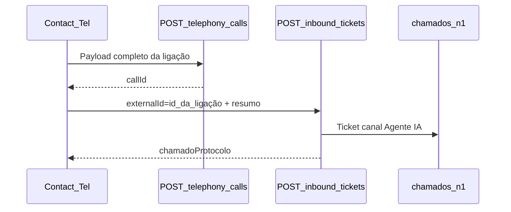

# API Inbound Tickets — Agente IA Telefônico

<!-- VERSION: v1.1.0 | DATE: 2026-09-09 | AUTHOR: VeloHub Development Team -->

Documento para **homologação e uso** da API de **abertura de tickets** no Velodesk após atendimento do **Agente IA Telefônico** (Contact Tel / LetícIA).

> **Importante:** este endpoint **cria** o chamado no Desk. Não confundir com `POST /api/inbound/telephony/calls`, que **registra a ligação** em `telephony_calls` para o módulo Atendimento IA Telefônico. Os dois fluxos são complementares: ligação → `telephony/calls`; abertura de ticket para o agente humano → este endpoint.

---

## URL base (produção)

**Base URL:** `https://velodesk-278491073220.us-east1.run.app`

| Endpoint | URL completa |
|----------|--------------|
| Health | `https://velodesk-278491073220.us-east1.run.app/api/inbound/tickets/health` |
| Criar ticket | `https://velodesk-278491073220.us-east1.run.app/api/inbound/tickets` |

---

## Autenticação e segurança

A rota `POST /api/inbound/tickets` exige **somente** os headers abaixo:

```http
Content-Type: application/json
X-Inbound-Agente-Ia-Secret: <chave_35_caracteres>
```

| Header | Obrigatório | Descrição |
|--------|-------------|-----------|
| `Content-Type` | Sim | `application/json` |
| `X-Inbound-Agente-Ia-Secret` | Sim | Chave exclusiva do Agente IA (`INBOUND_TICKET_AGENTE_IA_SECRET` no servidor Velodesk) |

### Formato da chave

- Exatamente **35 caracteres**
- Apenas letras minúsculas (`a-z`) e números (`0-9`)
- Exemplo de formato: `m3n8q1w6e9r2t5y0u4i7o1p6a3s8d2f5g0h4j7k9l2`

A chave real será entregue **separadamente** pela equipe VeloHub — não commitar em repositórios.

### Respostas de autenticação

| HTTP | Corpo | Causa |
|------|-------|-------|
| `401` | `{ "message": "Header de autenticação inbound ticket ausente" }` | Header `X-Inbound-Agente-Ia-Secret` ausente |
| `401` | `{ "message": "Chave inbound ticket inválida — use 35 caracteres [a-z0-9]" }` | Formato da chave incorreto |
| `401` | `{ "message": "Chave inbound ticket incorreta" }` | Valor da chave errado |
| `503` | `{ "message": "Inbound tickets desabilitado" }` | `INBOUND_TICKETS_ENABLED=false` |
| `503` | `{ "message": "Inbound tickets desabilitado — secret ausente (agente-ia)" }` | Produção sem secret configurado |

---

## Health check (sem autenticação)

```http
GET https://velodesk-278491073220.us-east1.run.app/api/inbound/tickets/health
```

**Resposta `200`:**

```json
{
  "status": "ok",
  "enabled": true,
  "apiVersion": "1.0.0",
  "origins": ["app", "telefone", "agente-ia", "chat"],
  "secretFormat": "[a-z0-9]{35}"
}
```

---

## POST — Criar ticket (Agente IA)

```http
POST https://velodesk-278491073220.us-east1.run.app/api/inbound/tickets
Content-Type: application/json
X-Inbound-Agente-Ia-Secret: <chave_35_caracteres>
```

### Payload

**Obrigatórios:**

| Campo | Tipo | Descrição |
|-------|------|-----------|
| `externalId` | string | ID único da ligação/atendimento (recomendado: `id` da call Contact Tel) |
| `title` ou `chamadoTitulo` | string | Título do chamado |
| `text` ou `description` | string | Resumo ou transcrição da ligação |
| `clientName` | string | Nome do cliente |

**Identificação do cliente (ao menos um):**

| Campo | Tipo |
|-------|------|
| `clientCPF` | string |
| `clientPhone` | string |
| `clientEmail` | string |

**Opcionais recomendados para telefonia IA:**

| Campo | Tipo | Descrição |
|-------|------|-----------|
| `responsavel` | string | Agente humano que assumirá o ticket |
| `clientPhone` | string | Telefone E.164 ou BR (ex.: `5511999990001`) |
| `clientCPF` | string | CPF coletado na ligação (`variables.cpf`) |
| `metadata.telephonyCallId` | string | `_id` do documento em `telephony_calls` no Desk (se já registrado via `telephony/calls`) |
| `metadata` | object | Outros dados da ligação (campanha, intenção, etc.) |

**Opcionais gerais:**

| Campo | Tipo |
|-------|------|
| `attachments` | string[] |
| `priority` | `baixa`, `media`, `alta` |
| `produto`, `motivo`, `detalhe` | string |

**Não enviar:**

- `canal` — ignorado; o servidor grava **`Agente IA`** automaticamente

### Exemplo

```json
{
  "externalId": "2ced4103-faa2-44ec-8b8e-7a86bbd2d410",
  "title": "Ligação IA — Mariana Silva",
  "text": "Cliente pediu continuidade por WhatsApp. Resumo: aceitou receber link no WhatsApp.",
  "clientName": "Mariana Silva",
  "clientPhone": "5511999990001",
  "clientCPF": "12345678901",
  "responsavel": "Mariana Operacoes",
  "metadata": {
    "telephonyCallId": "674a1b2c3d4e5f6789012345",
    "agentName": "Bia Comercial",
    "callStatus": "completed"
  }
}
```

### Respostas

**`201` — ticket criado:**

```json
{
  "action": "created",
  "ticketId": "674a1b2c3d4e5f6789012345",
  "chamadoProtocolo": "VD-20260813-0042",
  "canal": "Agente IA"
}
```

**`200` — retry com mesmo `externalId`:**

```json
{
  "action": "duplicate",
  "ticketId": "674a1b2c3d4e5f6789012345",
  "chamadoProtocolo": "VD-20260813-0042",
  "canal": "Agente IA"
}
```

---

## POST — Responder a um ticket já aberto (continuidade)

O **mesmo endpoint** `POST /api/inbound/tickets` serve para anexar uma nova mensagem a um ticket que o Agente IA (ou o cliente, via este canal) já abriu — por exemplo, quando a ligação retorna ao mesmo assunto ou o agente humano precisa que o histórico continue no mesmo protocolo em vez de abrir um novo.

Basta incluir `chamadoProtocolo` no payload. Quando esse campo vem preenchido:

- `title`/`chamadoTitulo` **deixa de ser obrigatório** (só importa para abrir ticket novo).
- `externalId` continua obrigatório e **deve ser único por mensagem** (cada resposta tem seu próprio `externalId` — não reaproveite o da criação).
- O `text`/`description` enviado é anexado como nova mensagem pública do cliente no ticket.

### Payload (resposta)

| Campo | Tipo | Obrigatório | Descrição |
|-------|------|--------------|-----------|
| `externalId` | string | Sim | ID único **desta mensagem** (não da conversa/ticket) |
| `chamadoProtocolo` | string | Sim (para responder) | Protocolo retornado na criação (`VD-YYYYMMDD-####`) |
| `text` ou `description` | string | Sim | Conteúdo da resposta |
| `clientName` | string | Sim | Nome do cliente |
| `clientCPF` / `clientPhone` / `clientEmail` | string | Ao menos um | Mesma identificação usada na criação |
| `attachments` | string[] | Não | URLs de anexos já hospedados |
| `metadata` | object | Não | Dados extras da mensagem |

### Exemplo

```json
{
  "externalId": "2ced4103-faa2-44ec-8b8e-7a86bbd2d410-msg2",
  "chamadoProtocolo": "VD-20260813-0042",
  "text": "Cliente ligou de novo confirmando que recebeu o link no WhatsApp.",
  "clientName": "Mariana Silva",
  "clientCPF": "12345678901"
}
```

### Respostas

**`200` — mensagem anexada ao ticket existente:**

```json
{
  "action": "replied",
  "ticketId": "674a1b2c3d4e5f6789012345",
  "chamadoProtocolo": "VD-20260813-0042",
  "canal": "Agente IA"
}
```

**`400` — protocolo informado não existe:**

```json
{
  "message": "chamadoProtocolo inválido — ticket não encontrado"
}
```

**`201` — ticket **novo** criado (não anexado):** se o ticket referenciado por `chamadoProtocolo` já estiver **fechado**, **cancelado** ou **resolvido há mais de 48h**, o servidor não reabre — ele cria um ticket novo automaticamente, com uma nota interna registrando a origem (`Novo ticket derivado de VD-20260813-0042`). A resposta nesse caso é igual à de criação (`action: "created"`, com um `chamadoProtocolo` novo).

> Reenviar o mesmo `externalId` de uma resposta (retry) devolve `200` com `action: "duplicate"`, sem duplicar a mensagem — mesma garantia de idempotência da criação.

---

## Fluxo recomendado com telephony/calls



1. Enviar ligação para `POST /api/inbound/telephony/calls` (registro + módulo IA Telefônico)
2. Quando houver necessidade de ticket no Desk, chamar este endpoint com `externalId` = `id` da ligação
3. Opcional: incluir `metadata.telephonyCallId` com o `callId` retornado pelo passo 1

---

## Exemplo curl

```powershell
curl.exe -s -X POST "https://velodesk-278491073220.us-east1.run.app/api/inbound/tickets" `
  -H "Content-Type: application/json" `
  -H "X-Inbound-Agente-Ia-Secret: <chave_35_caracteres>" `
  -d "{\"externalId\":\"2ced4103-faa2-44ec-8b8e-7a86bbd2d410\",\"title\":\"Ligação IA — Mariana Silva\",\"text\":\"Cliente pediu continuidade por WhatsApp.\",\"clientName\":\"Mariana Silva\",\"clientPhone\":\"5511999990001\",\"clientCPF\":\"12345678901\",\"responsavel\":\"Mariana Operacoes\"}"
```

---

## Checklist de homologação (Agente IA)

- [ ] `GET /api/inbound/tickets/health` retorna `enabled: true`
- [ ] `POST /api/inbound/tickets` com `X-Inbound-Agente-Ia-Secret` correto retorna `201 created`
- [ ] Retry com mesmo `externalId` retorna `200 duplicate`
- [ ] Requisição sem header retorna `401`
- [ ] Ticket no Desk com canal **Agente IA**
- [ ] Protocolo retornado na resposta
- [ ] Resposta com `chamadoProtocolo` válido retorna `200 replied` e anexa a mensagem ao ticket
- [ ] Resposta com `chamadoProtocolo` de ticket fechado/cancelado/resolvido há +48h retorna `201 created` (ticket novo derivado)
- [ ] Resposta com `chamadoProtocolo` inexistente retorna `400`
- [ ] (Opcional) Ligação ainda visível em Atendimento IA Telefônico via `telephony/calls`

---

## Referências internas VeloHub

| Recurso | Caminho |
|---------|---------|
| Rotas inbound | `backend/src/routes/inbound.routes.ts` |
| Serviço tickets | `backend/src/services/inbound-ticket/inboundTicket.service.ts` |
| Auth Agente IA | `backend/src/middleware/inboundTicketAuth.ts` |
| Registro de ligação (fluxo separado) | `docs/api-inbound-telephony-parceiro.md` |
